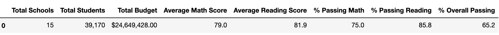

# School-District-Analysis
Utilizing Jupyter Notebook and Python to analyze school district data based on their budget and priorities

# Project Overview
Maria, the chief data scientist in the city school district, needs to analyze multiple forms of data across a school district to gain insight on school performance based on student funding and standardized test scores. This project's purpose is to aggregate data and showcase trends in school performance. 

# Challenge
The school district discovered the standardized test scores for the ninth graders at Thomas High School had been altered. Thus, we need to replace the math and reading scores for Thomas High SChool with NaNs while making sure the rest of the data has not changed. 

# Results
## School District Summary
Whem looking at average scores and passing percentages among the fifteen high schools in our dataset, the average math score dropped .1, but the average reading score remained unaffected. The three metrics of percentages of passing all decreased by approximately .1%-.3%. 
### Prior to Data Removal

### After Data Removal

## School Summary
The school summary was affected greatly at first because when we just removed the data the passing percentages for reading, math, and the overall passing percentage for Thomas High School all drastically dropped from around 90% to approximately 65%- 70%. You can see Thomas High School in the last column of the pictures below. This would ultimately affect the performance relative to the other schools as Thomas High School would not be ranked in the top 5 with an overall passing rate below 70%. 

### Prior to Data Removal

### After Data Removal

However, once we recalculated our data with just the 10th-12th graders scores, the data was much less affected as shown below. Now, the school summary is nearly the same. The top five schools and bottom five schools remain unchanged, and Thomas High School continues to stay in the top 5 as now the numbers have decreased by less than just 1%.

### Top Five Schools

### Bottom Five Schools

## Math and Reading Scores by Grade
The data removal did not affect the math and reading scores by grade. As shown below, the ninth graders math and reading scores from Thomas High School show "nan". All other data remained intact.

### Prior to Data Removal
#### Math

#### Reading

### After Data Removal
#### Math

#### Reading

## Math and Reading Scores by School Spending 
The data removal also did not make a difference in the math and reading scores by school spending. As shown below, the data is the exact same without the ninth grade data from Thomas High School.

### Prior to Data Removal

### After Data Removal

## Math and Reading Scores by School Size
Again, the data replacement did not make a difference in the math and reading scores by school size. As shown below, the data is the exact same without the ninth grade data from Thomas High School.

### Prior to Data Removal

### After Data Removal

## Math and Reading Scores by School Type
Lastly, the data replacement did not make a difference in the math and reading scores by school type either. As shown below, the data is the exact same without the ninth grade data from Thomas High School.

### Prior to Data Removal

### After Data Removal

# Summary
In summary, the data removal of the altered ninth grade data from Thomas High School and the replacement with the data that only included tenth through twelfth grade data from Thomas High School did not affect the school district analysis. The change was negligible and most everything remained the same. If we had not replaced the data, then there would have been signifcant changes to the analysis. Before the replacement, the percentage for passing math, reading, and overall for Thomas High School were extremely impacted and decreased significantly. Once the data was recaluclated without the ninth grade data, the difference was practically imperceptible.
